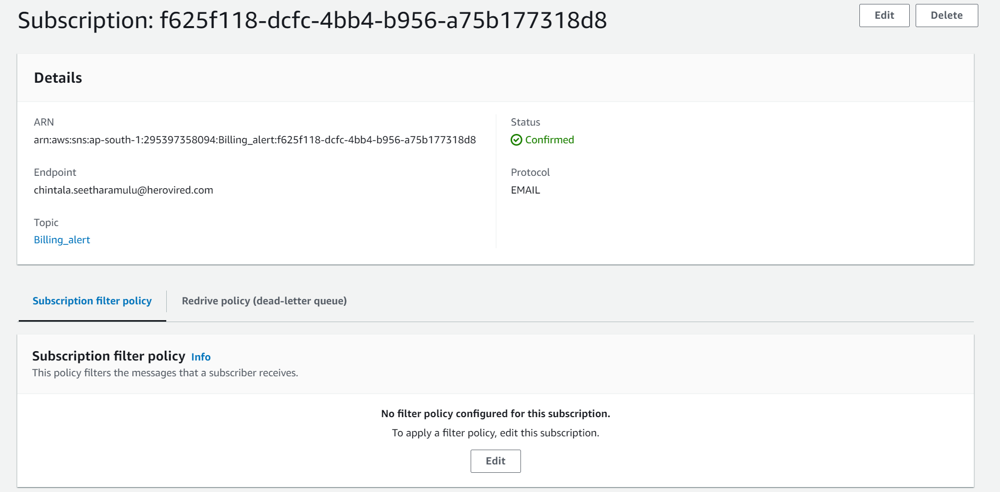

# Lambda Projects Q1 - Q2 - Q4

## Assignment 1: Automated Instance Management Using AWS Lambda and Boto3

1. Create a new lambda function
    
2. Add code into the lambda function from lambda-q1.py file

3. Create two ec2 instance tag the "Action" key accordingly. i.e. one with "Auto-Start" & "Auto-Stop. start the ec2 manually one with Auto-Stop as tag. Example image given below

4. Run Lambda Function and check response

5. Check in ec2 console if servers are started and stopped

#
## Assignment 2: Automated S3 Bucket Cleanup Using AWS Lambda and Boto3

1. Navigate to the S3 dashboard and create a new bucket.

    - Upload multiple files to this bucket, ensuring that some files are older than 30 days (you may need to adjust your system's date temporarily for this or use old files).

2. Lambda IAM Role:

   - In the IAM dashboard, create a new role for Lambda.

   - Attach the `AmazonS3FullAccess` policy to this role. (Note: For enhanced security in real-world scenarios, use more restrictive permissions.)

3. Lambda Function:

   - Navigate to the Lambda dashboard and create a new function.

   - Choose Python 3.x as the runtime.

   - Assign the IAM role created in the previous step.

   - Write the Boto3 Python script from lambda-q2.py:

        a. Initialize a boto3 S3 client.
        b. List objects in the specified bucket.
        c. Delete objects older than 30 days.
        d. Print the names of deleted objects for logging purposes.

    

#
## Assignment 4: Monitor Unencrypted S3 Buckets Using AWS Lambda and Boto3

1. Goto SNS (Simple Notification Service Dashboard) and create your topic

2. Subscribe to the recently created SNS

3. Goto Lambda Dashboard and create a lambda expression, Add a code to lambda given in (lambda_projects\monitor-unencrypted-ec2\lambda-q4.py)

4. After creating the lambda manually trigger it, it will check if all the buckets is having an server side encrypted configuration, if it is not found it will delete the s3 bucket.

5. Check you mail to recieve the list of deleted buckets. Do not forget to check in spam folders.
